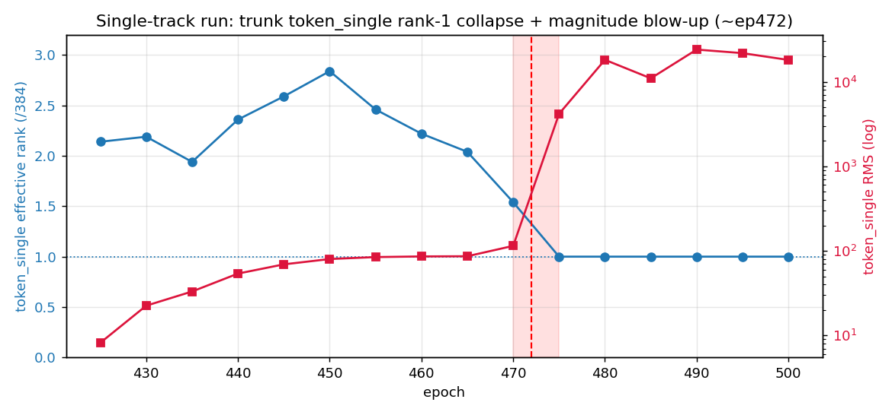
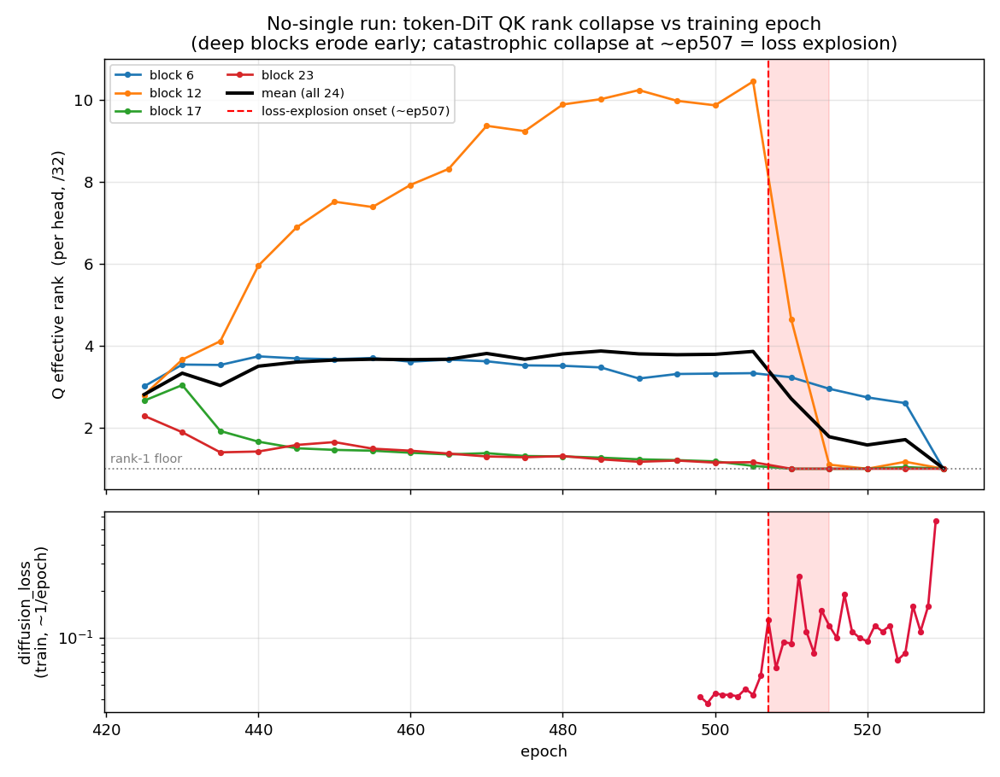
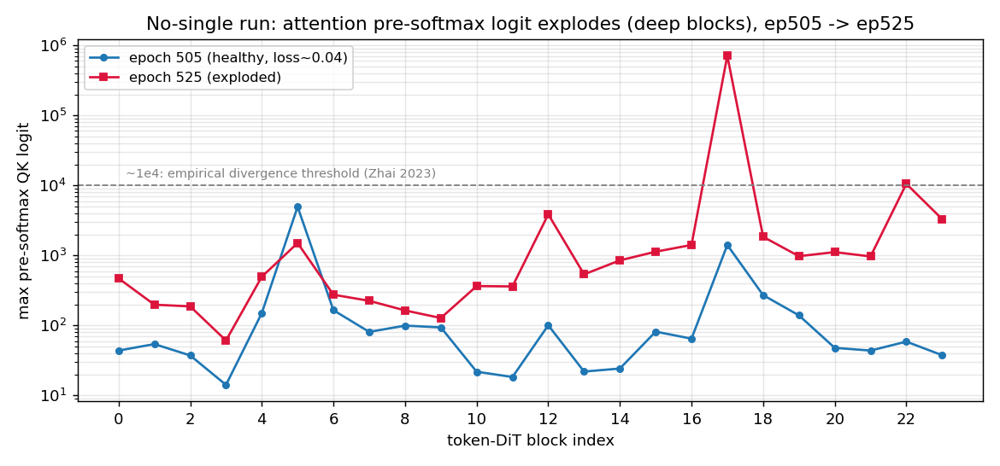

# Rank Collapse 분석: EDM diffusion 학습의 loss explosion

AF3-like EDM(frozen distogram trunk 위 diffusion module 학습) 실험들이 반복적으로
**loss explosion**으로 망가졌다. 원인을 추적한 결과 **두 곳에서 동일한 rank-collapse 실패
모드**가 관찰되었고, 둘 다 "정규화되지 않은 성분이 학습 중 한 방향(rank-1)으로 붕괴하며
값이 폭발"하는 동일한 메커니즘이다.

- 현상 A: 트렁크 `token_single` track의 rank-1 붕괴 (3/24/3 **single** 변형)
- 현상 B: diffusion token-DiT의 **QK** rank 붕괴 → attention logit 폭발 (3/24/3 **no-single** 변형)

분석일: 2026-06-15. 관련 문서: [edm_token_single_rank_collapse.md](edm_token_single_rank_collapse.md).

---

## 0. 측정 방법

체크포인트를 로드해 학습과 동일하게 **트렁크를 freeze**하고 **고정 배치 1개**(seed=0)에
대해 forward(+필요시 backward)를 돌려 중간 activation/gradient를 hook으로 캡처했다.
모든 trajectory는 **동일 배치**로 측정해 차이는 가중치(epoch) 변화만 반영한다.

- effective rank = 특이값의 participation ratio `(Σσ²)² / Σσ⁴`.
- QK rank: query projection을 `(L_residue, d_head)` 행렬로 보고 head별 effrank를 평균.
- 트렁크/diffusion 모두 학습 시 recycle은 random 1..4, 측정은 명시한 경우 고정.

---

## 1. 현상 A — 트렁크 `token_single` rank-1 붕괴 (single 변형)

distogram-only 사전학습은 `distogram_head(token_pair)`만 supervise한다. `token_single`
track(pairformer `pair_to_single`+`transition_single`, EDM에서 새로 학습)은 **무감독**이라
스케일/방향에 제약이 없다. 결과:

| epoch | token_single eff_rank (/384) | RMS |
|---|---|---|
| 425 | 2.14 | 8 |
| 450 | 2.84 | 80 |
| 465 | 2.04 | 86 |
| 470 | 1.54 | 115 |
| **475** | **1.00** | **4,173** |
| 500 | 1.00 | 18,088 |

- 처음부터 저랭크(≈2/384)였고 **epoch ~472에서 rank-1로 붕괴 + magnitude 폭발(RMS 115→4,173)**.
- rank-1 = 모든 잔기의 single 벡터가 같은 방향(크기만 다름). per-token LayerNorm 이후에도
  잔기 간 cosine = 1.0000 → diffusion conditioning에 들어가는 single이 **잔기별 정보 0**.
- bf16(크기 1e4대에서 표현 간격 ~256)이 잔기별 미세차를 양자화로 지워 붕괴를 가속.

이 발견 때문에 **트렁크에서 single을 아예 제거한 `miniworld_no_single_at_trunk`**를 만들었다
(현상 B는 그 변형에서 관찰).

---

## 2. 현상 B — token-DiT QK rank 붕괴 → attention logit 폭발 (no-single 변형)

single을 제거했는데도 같은 패턴으로 터졌다. 이번엔 **학습되는 token-DiT(24블록)의
attention Q/K**에서 발생한다.

### 2.1 언제부터? — rank trajectory

- **시작(ep420, random init)**: Q effrank ≈ 3.9/32, logit_max ≈ 2.4 — attention 정상(작은 logit,
  정렬 없음). effrank가 32가 아닌 건 입력 conditioning이 원래 공통모드 지배적이라 그렇다.
- **ep425~505 (서서히 침식)**: 깊은 블록(17,23)이 ~2.7→~1.0으로 먼저 깎이고, 중간 블록(12)은
  오히려 ~10까지 올랐다가 버틴다. mean은 ~3.8 유지.
- **ep505→515 (catastrophic collapse)**: 버티던 블록들까지 무너져 mean 3.86→1.78→1.0.
  이 시점이 **diffusion_loss explosion 시작(~ep507)과 정확히 일치**한다.

즉 rank는 "처음엔 살아있다가 깊은 층부터 침식되고, ep~507에 급붕괴"한다.

### 2.2 무슨 일이? — pre-softmax logit 폭발 / softmax 포화

| | logit_max (ep505→525) | softmax row-max mean |
|---|---|---|
| block 12 | 101 → 3,874 | 0.07 → 0.86 |
| **block 17** | 1,414 → **714,544** | 0.63 → 0.96 |
| block 22 | 59 → 10,557 | 0.15 → 0.86 |

깊은 블록의 pre-softmax QK logit이 폭발(block 17: ×500)하고 softmax가 거의 one-hot으로
포화(row-max→0.96)된다. token-DiT residual stream도 깊이 따라 누적 증폭(block23 출력 ~1.2e4).
> "softmax 값"은 [0,1]이라 폭발 못 한다. 폭발하는 건 **pre-softmax logit**이고, 그 결과
> softmax가 포화/붕괴하는 것이다.

### 2.3 magnitude인가 rank인가? — 분해

`logit_ij = |q_i| |k_j| cos(q_i,k_j) / √d` 로 분해(ep525, no-single):

| block | effrank q/k (/32) | logit_max | cos@max | |q||k|/√d 상한 |
|---|---|---|---|---|
| 17 | 1.25 / 1.23 | 33,803* | **0.999** | 33,822 |
| 22 | 1.00 / 1.00 | 10,655 | -0.992 | (≈상한) |
| 23 | 1.00 / 1.00 | 3,193 | (≈상한) | (≈상한) |

(*샘플/배치 차이로 §2.2와 절대값 다름, 경향 동일)

- **지배 인자는 rank/정렬**이다. Q,K가 head당 **rank-1로 붕괴(effrank≈1)**하고 최상위 쌍의
  **cos@max≈±1** → 내적이 완전 보강되어 logit이 이론 상한 `|q||k|/√d`를 **거의 그대로 달성**.
- 정상 full-rank attention이면 무작위 q,k의 cos≈1/√32≈0.18이라 logit이 상한의 ~18%에 그쳐야
  하는데, rank 붕괴로 **1/√rank 억제가 사라진다.**
- magnitude(norm)도 늘지만(예: block17 q-norm 309→425) 부차적. logit ×500을 norm 성장만으로는
  설명 못 한다.

### 2.4 "한 방향" = 잔기 간 정렬 (실측)

ep525, dominant head에서 잔기(토큰) 간 query 벡터 pairwise cosine:

- block 22, 23: **+1.000** (모든 잔기가 정확히 같은 방향, 크기만 다름 → rank-1 외적 `u⊗v`)
- block 12: +0.984
- block 17: |cos|=0.90, signed≈0.06 (같은 **축** ±v 위에 있으나 부호가 갈림 → bipolar rank-1)

logit 행렬도 rank-1(`u_i w_j c`)이 되어 **모든 잔기가 같은 1~2개 key만 본다** → attention이
위치별 분별력을 잃은 degenerate 상태.

---

## 3. 메커니즘 요약

1. 정규화되지 않은 성분(현상 A: 무감독 single track / 현상 B: QK-norm 없는 attention)이
2. 학습 드리프트로 **한 방향(rank-1)으로 정렬**되고 (깊이가 깊을수록 빨리 — depth-induced),
3. 정렬로 내적이 완전 보강 + magnitude가 성장 → **값 폭발**(single RMS 1e4 / logit 1e5),
4. 그 위에서 residual stream/conditioning이 누적 증폭 → **loss explosion**.

---

## 4. 알려진 현상 (문헌)

전형적인 transformer 학습 불안정성의 결합이다.

- **Attention entropy collapse** (Zhai et al., Apple 2023): QK 정규화가 없으면 logit 가중치
  norm이 무한정 성장 → logit↑ → softmax near one-hot(엔트로피→0) → 발산. 경험적으로
  **max logit > ~1e4면 학습이 터진다** (우리도 1e4~1e5 도달).
- **QK-LayerNorm / ViT-22B** (Dehghani et al. 2023): ~8B 규모에서 동일 발산을 Q/K LayerNorm으로
  해결.
- **Depth-induced rank collapse / token uniformity** (Dong et al. 2021; Noci et al. 2022):
  순수 self-attention은 깊이에 따라 표현을 rank-1로 수렴시킨다 → **깊은 블록이 먼저 붕괴**하는
  관찰과 일치.

참고:
- Zhai et al. 2023, *Stabilizing Transformer Training by Preventing Attention Entropy Collapse* — https://arxiv.org/abs/2303.06296
- Dehghani et al. 2023, *Scaling ViT to 22B Parameters* (QK-LayerNorm) — https://arxiv.org/pdf/2302.05442
- Dong et al. 2021, *Attention is not all you need: ... rank doubly exponentially with depth*
- Noci et al. 2022, *Signal Propagation in Transformers: the Role of Rank Collapse* — https://arxiv.org/pdf/2206.03126

---

## 5. 대응 (적용)

`config_exp_msa3_24_3_no_single_qknorm_bf16_edm.yaml` 실험에서:

1. **QK-norm on diffusion attention** (`atom_dit` + `token_dit`의 `use_qk_norm: True`).
   Q,K를 RMSNorm해 logit을 `√d_head·cos ∈ [−√d, √d]`로 **상한**. frozen 트렁크/
   input_feature_embedder엔 적용 금지(ckpt에 없는 param 추가 → 트렁크 OOD화).
2. **데이터 정렬** (atom tokenization + `missing_policy=gap`): frozen 트렁크를 in-distribution으로
   되돌려 distogram ~1.0 회복(=conditioning 품질 회복; dynamic+query에선 ~1.6).
3. **bf16 autocast** (params fp32 master 유지): 속도·메모리 이득, 학습 안정.

추가로 고려 가능: single track 자체 제거(완료), weight decay/σReparam, logit soft-capping,
attention head 다양성 정규화.

---

## 부록: 측정 스크립트 (세션 산출물, repo 미포함 `/tmp`)

- `debug_edm_activations.py` — 전 모듈 activation/grad 통계
- `rank_trajectory.py` / `rank_traj_qk.py` — token_single / QK effrank epoch 궤적
- `probe_nosingle_attn.py` — attention logit + softmax 포화
- `probe_qk_decomp.py` — magnitude vs rank/정렬 분해, 잔기 간 cosine
- `make_rank_figs.py` — 본 문서 figure 생성
