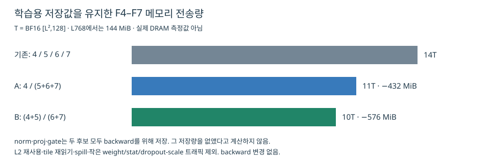

# F4–F7 융합: 기존 시도와 학습 메모리 전송량

확인: 2026-09-16. **이번 단계에서는 신규 커널이나 GPU 잡을 만들지 않고**, Git 객체·개발 기록·소스 본문을 조사하고 메모리 모델을 계산했다. 대상은 H100 양방향 학습, BF16, B=1, pair/output N=128, output projection K=256, gate K=128이다.

## 연산 번호

- **F4:** 출력 LayerNorm.
- **F5:** 정규화값의 출력 projection GEMM (256→128).
- **F6:** 입력 정규화값의 gate GEMM (128→128).
- **F7:** sigmoid · projection과 곱 · dropout · residual 덧셈.

## 결론

두 아이디어의 선행 구현은 있다. 그러나 **현재 양방향 shape + dropout/residual + 같은 backward 저장 정책 + Triton 구현**으로 두 후보를 나란히 비교한 완성된 실험은 조사한 기록에서 찾지 못했다.

- **A: F4 / F5+F6+F7** — 두 GEMM + sigmoid·곱을 융합한 `tm2` / dt-v1이 출발점이다. 서로 다른 K, 학습용 저장값, dropout/residual을 맞춰야 한다.
- **B: F4+F5 / F6+F7** — 과거 CuTe split-back에 가까운 구성이 있다. 현재 학습용 saveact와 완전한 F7을 붙인 Triton 버전은 추가 개발·검증이 필요하다.
- 같은 backward를 유지할 때 B가 A보다 정규화 버퍼 소비 읽기를 더 많이 줄인다. **메모리 측면 우선순위는 B**, A는 LN을 분리하여 기존 LN 구현을 유지하는 장점이 있다.
- 과거 실패는 특정 shape의 register/shared-memory 부족, port 오류, 저장값/재계산 비용을 포함한다. 융합 알고리즘 자체가 가망 없다는 증거가 아니다.

## 1. 실제로 있었던 시도

| 제안과 관계 | 과거 구현/기록 | 확인된 범위와 부족한 점 |
|---|---|---|
| A의 핵심 F5+F6+F7 | `tm2/triton/main.py:fused_sigmoid_gate2_fwd_kernel` | 두 GEMM의 accumulator를 유지하고 sigmoid·곱을 한 kernel에서 실행. square N=K를 공유하고 forward에 proj/gate 저장·dropout·residual 없음. backward는 GEMM을 재계산하므로 지금 저장형 backward와 바로 동등 비교하면 안 됨. |
| A의 학습용 변형 | `baseline_dtv1.py:_output_gated_gemm_kernel` / `_OutputGEMM` | dual GEMM + sigmoid·곱, FP32 sigmoid와 곱 결과를 저장. 두 입력의 K를 공유하며 현재 양방향 128/256과 다름. residual/dropout 포함 전 결과를 저장하는 다른 backward 정책임. |
| B에 가까운 추론 구현 | `5dcd6663`(6/27)의 `back_split.py` | M2 LN+projection 뒤 `gate_elem_quack_fused` 후보. 당시 fused 후보는 sigmoid(GEMM)×proj까지 한 커널. 다른 후보 `gate_elem_triton`은 실제로 cuBLAS+elementwise 두 launch. 파일 설명의 “2 kernels”를 모든 dispatch에 적용하면 틀림. |
| F6+F7의 학습 핵심 | `1694828d`(7/6 작성, 7/7 커밋) | B200 양방향 학습에서 fused gate 도입. 기록상 L1024 전체 6.1210→5.9963 ms(1.021×). 저장 preactivation에서 sigmoid를 backward 안에 재계산. **B200 과거 결과이며 현재 H100의 dropout/residual 포함 결과가 아님.** |
| F4+F5 학습 조사 | `lnout_fold_fusion_b200/v1.md` | B200에서 fold-GEMM+별도 stats가 baseline을 못 이겼고, fused stats는 CuTe bring-up 오류/naive CUDA 저성능. 이 결과를 H100/Triton의 불가능 판정으로 옮길 수 없음. |
| 더 큰 F4+F5+F6+F7 | `9bdf9260`(6/23), 이후 `a1551fed`(9/8) | Triton fused back 존재. 초기 큰 D에서 자원 부족; 이후 양방향의 다른 gate K도 처리하도록 추론 배선 확장. 현재 학습의 saved activations를 제공하는 경로와는 다름. |

### 과거 융합 경로를 분리한 이유가 모두 “느려서”는 아니다

- 6월 H100 forward D sweep: square D=128에서 전체 모듈 fused-v4 / split-v6가 L512 **0.351/0.361 ms**, L1024 **1.475/1.449 ms**로 비슷했다. D=256의 당시 monolithic 구현은 register/shared-memory 한계를 넘었고 split은 실행됐다. 이는 **당시 구현의 한계**다.
- 8/4 `1d1f5fc9`: M2→M1 전환은 quack 0.5.0 port의 정확성/호환성 문제 때문이었다.
- 8/4 `eebedbbc`: CuTe dual-A GEMM은 runtime TMA barrier deadlock을 고쳤고 타일 탐색 후 실행됐다. “융합이 느려서 폐기”한 기록이 아니다.
- 이번 출력 최적화에서 M1/M2 후보를 비교한 수치는 **forward+backward 및 재계산 비용을 포함**했다. 그것만으로 F4+F5 forward 융합이 불리하다고 단정하면 안 된다.

과거 타이밍은 각 문서의 기록이며 이번에 재측정한 값이 아니다. 오래된 설명의 “fused” 표현은 함수 단위와 GPU kernel 단위가 섞여 있으므로 소스 본문으로 구분했다.

## 2. 같은 backward를 유지한 메모리 계산

정의:

```text
M = L²
T = BF16 [M,128] 하나의 크기 = 2 × M × 128 bytes
tri / 정규화값 [M,256] = 2T
proj / glogit / gate / pair / x_n / y [M,128] = T
```

학습 backward가 읽을 **정규화값, proj, gate를 모두 저장**한다. 정규화값은 기존 Triton의 affine 적용 xn 또는 새 경로의 xhat이며 둘 다 크기는 2T다. 이를 저장하지 않고 재계산하는 다른 알고리즘은 이번 계산에 섞지 않았다.

| 구성 | 단계 | 읽기 | 쓰기 | 합계 |
|---|---|---:|---:|---:|
| 기존 | F4: tri → norm | 2T | 2T | 4T |
| 기존 | F5: norm → proj | 2T | T | 3T |
| 기존 | F6: x_n → glogit | T | T | 2T |
| 기존 | F7: glogit,proj,pair → y,gate | 3T | 2T | 5T |
| **기존 합계** | | **8T** | **6T** | **14T** |
| A | F4 | 2T | 2T | 4T |
| A | F567: norm,x_n,pair → y,proj,gate | 4T | 3T | 7T |
| **A 합계** | | **6T** | **5T** | **11T** |
| B | F45: tri → norm,proj | 2T | 3T | 5T |
| B | F67: x_n,proj,pair → y,gate | 3T | 2T | 5T |
| **B 합계** | | **5T** | **5T** | **10T** |

**무엇이 줄어드나:**

- A: `glogit` write+read **2T**, F7의 `proj` read **T** → **3T 절감**.
- B: `glogit` write+read **2T**, F5의 `norm` read **2T** → **4T 절감**.
- **proj 저장은 A에도 남는다. norm 저장은 B에도 남는다.** 학습 저장을 유지한 채 제거되는 것은 해당 forward 소비자의 읽기다.
- 두 후보 모두 F4–F7의 주 호출을 4개에서 2개로 줄인다. 전체 모델의 launch 수와 같은 뜻은 아니다.
- GEMM FLOPs `2MN(Kproj+Kgate)`는 같다. L768에서 약 **58.0 GFLOPs**로, 융합으로 곱셈 양이 줄어드는 것은 아니다.

### 수치

| L | T | A 절감 (3T) | B 절감 (4T) |
|---|---:|---:|---:|
| 128 | 4 MiB | 12 MiB | 16 MiB |
| 384 | 36 MiB | **108 MiB** | **144 MiB** |
| 768 | 144 MiB | **432 MiB** | **576 MiB** |
| 1024 | 256 MiB | 768 MiB | 1024 MiB |



### 실제 HBM 시간과의 관계

위 표는 **각 소비자가 tensor를 한 번 읽는 논리적인 global-memory 전송량 모델**이다. 실제 DRAM counter를 측정한 값이 아니다.

- weight/affine parameter, LN mean/rstd, 작은 row-broadcast dropout scale 및 생성 비용은 생략. 주로 공통이며 pair 크기 버퍼보다 작다.
- L2에 남은 데이터는 다시 읽어도 HBM에 가지 않을 수 있다. 특히 L128의 절감 bytes를 그대로 HBM 시간으로 바꾸면 과대평가할 수 있다.
- 출력 N 타일 분할에 따른 입력 재읽기·LN 반복 reduction, register spill, coalescing, cache eviction은 실제 트래픽을 늘린다.
- tile 간 `norm` 중복 store를 피해야 한다. norm을 저장했다가 같은 fused kernel 안에서 다시 전역 메모리로 읽으면 B의 절감 조건을 충족하지 못한다.

**유효 전송 대역폭을 임의로 2–3 TB/s로 가정**하면 L768의 절감 bytes에 해당하는 순수 전송시간은:

- A: **0.151–0.226 ms**.
- B: **0.201–0.302 ms**.

이는 대역폭 민감도 계산이며 H100의 실측 대역폭, 예상 latency 보장, 엄밀한 전체 speedup 상한이 아니다. memory/compute overlap 때문에 이 시간이 실행 시간에서 그대로 빠지지는 않는다. 반대로 launch 감소 및 layout 개선은 추가 이익이 될 수 있다.

현재 전체 모듈의 약 6.6–6.9 ms에 비해 기대할 효과는 우선 **몇 % 규모로 검증할 대상**이다. F4–F7 트래픽 21.4%/28.6% 감소를 전체 학습 21.4%/28.6% 가속으로 말하면 안 된다.

## 3. 구현 전에 정할 비교 계약

1. **F1–F3b 및 backward는 고정**, norm/proj/gate의 dtype·배치·저장값 계약도 동일하게 맞춘다.
2. A는 기존 Triton dual-accumulator를 재사용하되 **Kproj=256, Kgate=128을 독립 처리**한다. 없는 채널을 읽거나 전체를 억지로 square로 확장하지 않는다.
3. B의 F45는 mean/rstd와 backward용 norm을 함께 저장하며, F67은 gate 저장·dropout scale·residual까지 포함한다.
4. FP32 reference로 output·모든 gradient, zero gate/weight, mask, dropout graph replay를 확인한다. 융합에 따른 BF16 중간 rounding을 명시한다.
5. 기존/A/B의 **forward 구간과 전체 forward+backward를 모두** 비교한다. 타일·register spill·shared memory·실제 DRAM bytes를 함께 확인한다.

따라서 새로 처음부터 두 계열을 발명할 필요는 없다. **기존 구현을 현재 학습 계약에 맞춰 확장하고, B를 우선 후보로 삼되 A도 같은 조건으로 비교할 실익이 있다.**

## 근거 보관

- [원본 commit·파일 SHA](feasibility/provenance.json)
- [Triton tm2](feasibility/tm2-triton.py) · [dt-v1 output](feasibility/dtv1-output.py)
- [6월 CuTe split-back 소스](feasibility/june-split-source.py) · [당시 D sweep](feasibility/june-split-benchmark.md)
- [B200 gate 학습 융합 기록](feasibility/gate-b200.md) · [B200 LN–projection 조사](feasibility/ln-projection-b200.md)
- [HBM 모델 수치 JSON](feasibility/hbm-budget.json)
