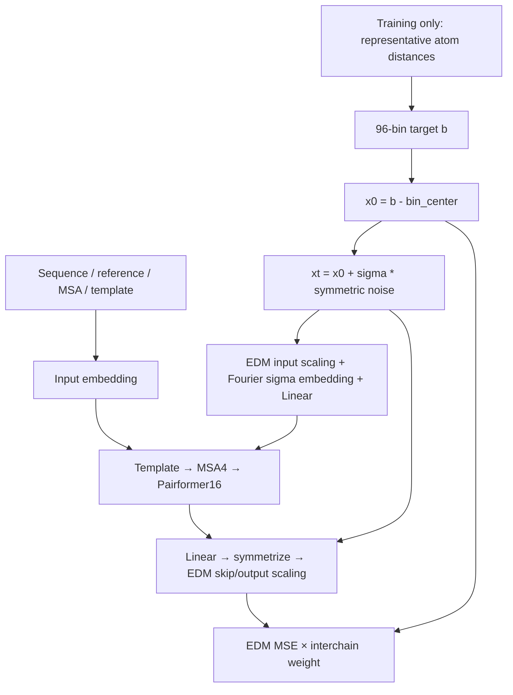

# v1.3.0: BioAI distogram diffusion

## Scope and provenance

Continue the BioAI Claude prototype (local `feat/distogram-diffusion`, commit
`1aeded4`; session `38ec9ed8-fbc5-4cd6-ae9b-69fa25b9c6f3`) on current MiniWorld
`e7869b3`. The earlier working name **v1.2.1 is superseded by v1.3.0**.
This is diffusion of a **96-bin distance image**, not the phase-2 all-atom
coordinate diffusion head. The trunk itself is the denoiser.

## Model and data

| Item | v1.3 |
|---|---|
| Trunk | 16 MiniPairformer + 4 MSA blocks, existing template and atom input embedder |
| Target | v1.2 chemical pseudo-beta representatives, 96 bins, edges 2.25–25.75 Å |
| Noise | One symmetric Gaussian draw per off-diagonal pair, one log-normal sigma per sample |
| Training | One noisy image → one differentiable trunk pass → predicted clean image |
| Inference | Heun reverse diffusion; 24 steps = 47 trunk evaluations; configurable |
| Loss | EDM weighted MSE; interchain pairs ×2; divide by valid i<j pair count |
| MSA | PDB pool up to8192, subset1024 per training pass; distillation pool2048 |
| Cropping | v1.2 Ab–Ag interface-only and nonprotein focus policies |
| Training buckets | L384/atom4096; L768/atom8192 continuation |
| Backend | Engine2 auto/native H100, fused MSA; no forced Triton |
| Default trainer | torch.compile + CUDA Graph from the first step; four GPUs × accumulation64 = batch256 |



`loss = mean_batch(lambda(sigma) * sum_valid(w_ij * (xhat_ij-x0_ij)^2) / count_valid)`.
`w_ij=2` iff `token_asym_id[i] != token_asym_id[j]`, otherwise1. This is the
same interchain policy as v1.2: all cross-chain pairs, **not only pairs under a
contact-distance cutoff**. Padding, diagonal and unobserved targets are excluded.
The denominator is not the sum of weights. This loss is not numerically comparable
to the old CE loss even though the logger retains the `distogram_loss` alias.

## Prototype corrections

- Resolve the three prototype/main conflicts while keeping v1.2 target fixes,
  cropping, per-pass MSA sampling, Engine2 parameter layouts and optimizer support.
- Pass interchain weight through the wrapped model forward; do not bypass Fabric/DDP.
- Remove unused recycling parameters and categorical head in diffusion mode only.
- Generate sigma on the input device; leave tensor metrics inside forward and
  convert to Python numbers only in the client outside the compiled model.
- Factor the encoder's linear map into distance and time terms. It has the same
  parameters but avoids constructing an `L×L×Fourier_dim` concatenation.
- Do not feed invalid-distance overflow sentinels as clean observations.
- Symmetrize decoded values in FP32. Preserve unit off-diagonal noise variance.
- Freeze the selected MSA throughout an inference trajectory. Inference does not
  read target coordinates, observed-coordinate masks or representative labels.
- End Heun at sigma0, with an Euler final step, consistent with the
  [official EDM sampler](https://github.com/NVlabs/edm/blob/main/generate.py).
  The shared AF3 scheduler deliberately ends at positive sigma_min and is unchanged.

## Initial preconditioning and calibration

The prototype constants (`bin_center=85.70`, `sigma_data=18.90`) came from an
older D96/L768 experiment. They are explicitly **initial guesses**, not a fresh
measurement of v1.3 at L384. No learned parameters depend on these constants.
Do not change them silently when resuming a checkpoint: they define the data space.

BioAI job272547 read64 training samples per crop with the current target helper,
correct atom budget, seed130 and configured source mixture:

| Crop | Valid pairs | Pair-pooled mean / std | Equal-structure mean / std |
|---|---:|---:|---:|
|384|3,305,002|80.485 / 22.431|79.592 / 22.891|
|768|8,008,837|85.496 / 19.144|82.234 / 21.497|

These are pilot statistics, not a converged calibration. Equal-structure moments
match the per-sample normalization of the loss; pair-pooled moments give larger
structures more weight. `scripts/measure_distogram_sigma_data.py` emits both.

## BioAI runtime and validation

`scripts/bioai_v130_runtime.sh` selects a process-local Engine2 source snapshot at
`runs/v1.3.0/implementation_20260924/runtime/engine-src` (base55304541 + the verified
D64 Transition input-buffer barrier). FlashAttention4 `4.0.0b19` is installed into
that runtime's `python/` directory; CUDA12.8 is supplied by the BioAI module system.
The shared Pixi environment and existing v1.2 training snapshots are untouched.
The original conflicted BioAI files and index/worktree patches were backed up in
`runs/v1.3.0/implementation_20260924/original/`.

- Local CPU and BioAI CPU:111 passed,2 CUDA-only tests skipped, plus1 complete
  small-model gradient/target-free inference test passed on both servers.
- BioAI GPU head/target/RNG/graph tests:35 passed (job272548).
- Complete L384/atom4096 PF16 compile + four-rank forward/backward:
  job272548 **COMPLETED, exit0**. All four ranks completed3 optimizer updates,
  with433 finite gradient tensors each. Encoder and Pairformer gradients were
  nonzero after the initially zero decoder's first update. Ranks1/3 zeroed the
  masks of four synthetic template slots; this is not a true T=0-template test.
  Ranks0/2 retained the synthetic template masks. Every rank then
  passed target-free inference, bin range and symmetry checks.
- GPU result files: [rank0](v1.3-validation/gpu-smoke-272548-rank0.json),
  [rank1](v1.3-validation/gpu-smoke-272548-rank1.json),
  [rank2](v1.3-validation/gpu-smoke-272548-rank2.json),
  [rank3](v1.3-validation/gpu-smoke-272548-rank3.json). The first event interval
  includes initial JIT compilation and is **not a training speed measurement**.
- L768 and L384 full-model graph preflights subsequently passed on CSSB node02,
  job16999, exit0 (details below).
- Long-run convergence and model quality are not established by these short checks.

The shared `RecycleGraphs` path now accepts the diffusion model's EDM loss and
passes interchain weight2 through its forward call. The dedicated
`check_distogram_diffusion_graph_v130.py` preflight checks full PF16 compilation,
capture/replay, fresh sigma, actual T=0 templates, 64-microbatch accumulated
gradients and Adam updates, using two real examples per rank. It compares the same
compiled model with and without graph replay. Gradient tolerance remains relative
L2 below1e-3 (near-zero exception: reference max<=1e-6 and max absolute error<=1e-8).
All-reduce and optimizer steps remain outside capture.

The v1.3 config and BioAI launcher now select `force_trainer=cudagraph` and
`compile=true` for both fresh starts and resumes. Diffusion dispatch goes to the
shared graph trainer, which captures exactly one trunk pass (no recycling).
The legacy CE-only graph trainer is not used for this model. Explicit
`force_trainer=fabric` remains available through the Python CLI for comparisons.

Fresh graph runs create a rank-consistent run directory, initialize model/Adam/
scheduler/FP32 EMA, and perform strict gradient validation before starting the
training log. An initial checkpoint is saved before the first update. Every
epoch checkpoint stores the model, optimizer, scheduler, EMA, epoch/step, run
directory, W&B ID, and per-rank PyTorch CPU/CUDA, NumPy and Python RNG states.
Resume infers the original run directory from the checkpoint. A fresh invocation
against an existing run root fails with a request to supply `--ckpt`, preventing
an accidental weight reset in the old log. `latest_run.txt` points to the run.

Validation temporarily gives a fresh zero-initialized decoder a nonzero update
even when warmup starts at lr0; all training state and RNG are then restored.
The optimizer load deep-copies checkpoint state, because Adam's CPU step tensors
otherwise alias the saved state and could be incremented by validation itself.

BioAI job272596 started sooner than its queue estimate but failed before capture:
the checker incorrectly used `Client.Config`, which discards data configuration.
It now uses the full training `Config`; CSSB path overrides are supported.
At the user's request, v1.2 training was temporarily stopped at checkpoint
epoch585/step58500, and node02's eight H100s were used as two four-rank groups.
Job16999 **COMPLETED, exit0** in4m39s, with all eight rank summaries passing.
Both sizes used actual data, actual T=0-template variants, 64-step accumulation,
and two diagnostic optimizer updates. Losses matched exactly, sigma sequences
matched exactly and contained64 distinct values on every rank, and post-Adam
encoder/Pairformer gradients were nonzero.

| Tokens / atoms | Compile fwd+loss+bwd | Compile + CUDA Graph | Speedup | Max gradient relative L2 |
|---|---:|---:|---:|---:|
|384 /4096|70.03ms|62.28ms|1.124x|1.6204e-7|
|768 /8192|258.21ms|253.42ms|1.019x|1.6069e-7|

Times are the pooled median across four ranks ×64 microbatches **after the
validation Adam update**, excluding input transfer, NCCL and optimizer/EMA.
Both groups ran concurrently on node02. These are short fixed-batch measurements,
not end-to-end training throughput or BioAI CUDA12.8 measurements.
See [full summary and provenance](v1.3-validation/graph-cssb-16999/result.json).

Local regression checks passed29 tests, with one GPU-only test skipped. The
diagnostic disables learning-rate warmup and uses lr1e-4 so its single validation
Adam update moves the zero-initialized decoder, exercising nonzero trunk gradients.
Production learning-rate configuration is unchanged. After that preflight, v1.2
training resumed with job16997, the same model/Adam/EMA checkpoint, frozen runtime
and W&B `tapgki9e`. Its final continuation after the lifecycle check is below.

### Fresh-start and resume validation

CSSB job17005 subsequently exercised the **real CLI training path**, using eight
H100s, L384, accumulation32 (batch256), production warmup, real data and an offline
W&B run. It started without a checkpoint, trained steps1–2, saved epoch1, exited,
and launched a new process from that checkpoint to complete steps3–4 at epoch2.
The run directory and W&B ID were unchanged. Adam step counts were exactly2→4,
scheduler/warmup learning rates were correct, EMA stayed FP32 and updated, and all
eight CUDA RNG states advanced and were checkpointed. Fresh and resumed gradient
preflights passed. No online W&B test run was created.

Local CPU tests:36 passed, one GPU-only test skipped; the same36 tests passed on
the BioAI login environment. See [lifecycle result](v1.3-validation/graph-start-17005.json).
The final scripts/config were deployed to BioAI. Production job **272610** was
submitted on 2026-09-24 at22:24:47 KST: H100×4, L384, PF16, compile + CUDA Graph,
accumulation64 (effective batch256), no recycling, interchain weight2.0. Its initial
state was `PENDING (Resources)`; graph preflight runs before training starts.
The scheduler estimated 2026-09-25 at00:10:40 KST, subject to change.
Log: `runs/v1.3.0/train-272610.log`.

For this final check, existing v1.2 training was paused at step58900 and resumes
with job17006 using W&B `tapgki9e`; Phase1b job16977 depends on `afterok:17006`.

## Launch and continuation

```bash
# On BioAI, from /home/psk6950/MiniWorld:
sbatch scripts/slurm/v130_bioai_smoke.sbatch
sbatch scripts/slurm/v130_bioai_data_check.sbatch
sbatch scripts/slurm/v130_bioai_graph_check.sbatch
# Long training entrypoint (already submitted as job272610; do not duplicate):
sbatch scripts/slurm/v130_bioai_train.sbatch

# Resume a v1.3 checkpoint at L768. Verify phase1a reached the intended endpoint first.
V130_CHECKPOINT=/absolute/path/to/v130/checkpoint.pt \
V130_CONFIG=configs/miniworld/distogram_diffusion_medium_v130_bioai_L768.yaml \
sbatch --export=ALL scripts/slurm/v130_bioai_train.sbatch
```

BioAI `gpu-4farm` requires at least4 GPUs per job and has a24-hour wall limit.
The launcher exits on errors and does not auto-submit an unbounded chain. Continue
from the last complete v1.3 checkpoint after a wall limit; keep its run directory
and W&B ID. The v1.3 run directory is distinct from v1.2. A v1.2 CE checkpoint is
not an optimizer-compatible v1.3 resume; start fresh unless a separate trunk-only
initialization experiment is requested.
