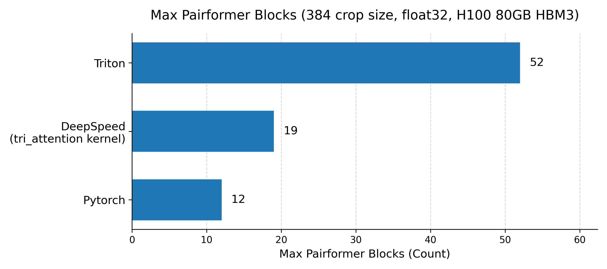

# Kernel User Guide

이 문서는 triton kernel로 최적화된 `Pairformer` 및 다른 모듈을 사용하기 위한 가이드를 제공합니다. 이 커널들은 주로 긴 서열 및 pair representation과 같이 큰 input을 처리하는 모듈에서 속도 및 메모리 효율성을 향상시키기 위해 설계되었습니다.


## Implemented Modules

| Module Name | Descripition | Notes |
| ---- | --- | -- |
| `SigmoidGateFunction` | `torch.sigmoid(x) * y` |
| `SwishFunction` | `x * torch.sigmoid(x) * y` |
| `TriangleMultiplication` | 속도 차이는 미미하나 메모리 효율 개선 |
| `TriangleAttention` | 서열 길이가 길어질수록 속도와 메모리 효율 크게 개선 |
| `Transition` | 서열 길이가 길어질수록 속도와 메모리 효율 크게 개선 | pair에 대해서만 작동함 |
| `LayerNorm` | 서열 길이가 길어질수록 속도와 메모리 효율 크게 개선 | pair에 대해서만 유의미한 성능 개선 |
| `AttentionPairBias` | 매우 긴 서열에 대해서만 유의미한 성능 개선, 일반적인 경우엔  오히려 성능에 부정적인 영향을 줄 수 있음  | TODO: seq parallel로 구현 안 됨 |
| `Pairformer` | 서열 길이가 길어질수록 속도와 메모리 효율 크게 개선. Deepspeed와 속도는 비슷하면서 메모리 사용량은 크게 감소 |


> [!Warning]
> 1. 현재 kernel들은 크기가 큰 input에 대해서만 최적화 되었습니다. 작은 크기의 input의 경우 사용하지 않는 것을 추천합니다.
> 2. 현재 kernel들은 `float32`에 대해서만 정상 작동하며, `torch.amp` 및 `torch.compile`과 호환되지 않습니다.


## Pairformer Benchmark



| Implementation | Memory (GB) per block |
| -- | -- |
| **Triton** | **1.53** |
| DeepSpeed | 4.2 |
| PyTorch | 6.6 |


## Quick Start

```python
import torch
from team_gm.modules import Pairformer

L = 384
n_block = 16
device = torch.device('cuda')

pair = torch.randn(1, L, L, 128).to(device)
single = torch.randn(1, L, 384).to(device)
mask = torch.rand(1, L).to(device) 
mask = mask > 0.5

config = Pairformer.Config(n_block=n_block, implementation="triton")
pairformer = Pairformer(config).to(device)
pair, single = pairformer.forward(pair, single, mask)
```